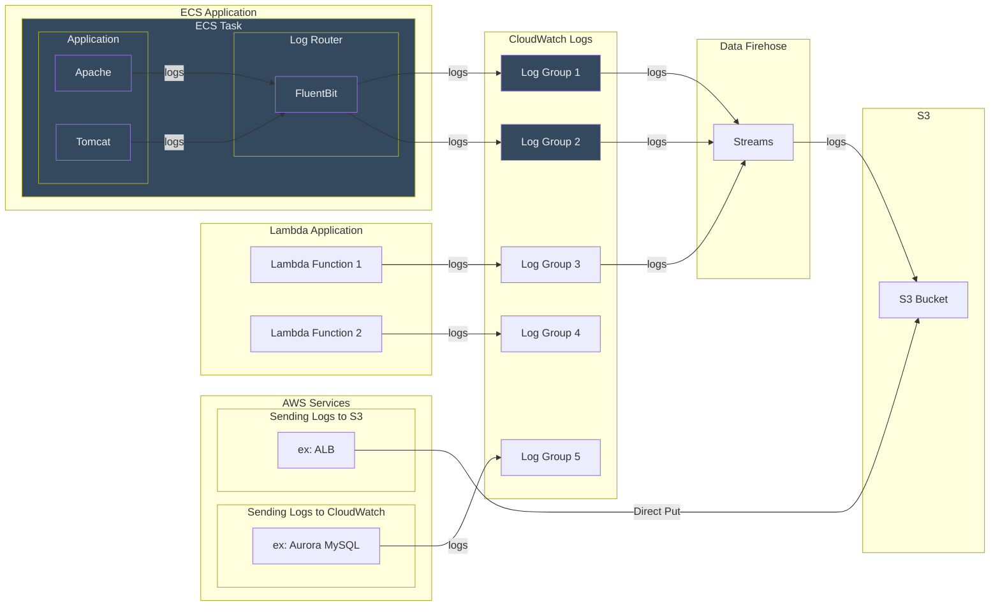
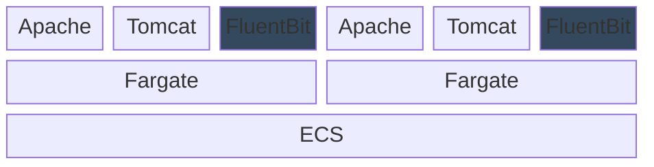
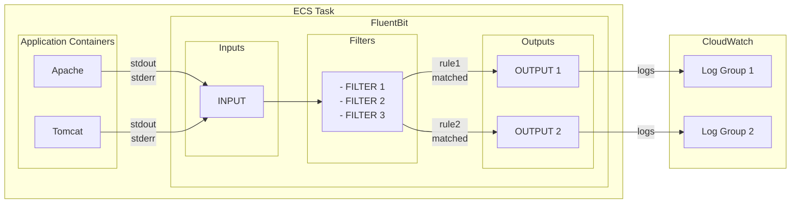

# FluentBit

**親ページ**

| 内容 | Markdownリンク | HTMLリンク |
|---|---|---|
| サイトマップ | [md](../sitemap.md) | <a href="../sitemap.html">html</a> |
| ログ管理 | [md](./log.md) | <a href="./log.md">html</a> |

---

**目次**
- [FluentBit](#fluentbit)
  - [概要](#概要)
    - [できること](#できること)
    - [関連図](#関連図)
    - [リソース構成](#リソース構成)
    - [ログ転送動作](#ログ転送動作)
  - [詳細](#詳細)
    - [INPUT](#input)
    - [FILTER](#filter)
    - [OUTPUT](#output)
    - [ヘルスチェック](#ヘルスチェック)
      - [設定](#設定)
      - [動作](#動作)
  - [改修の手引き](#改修の手引き)

## 概要

- アプリケーションが出力したログをフィルタリングおよびマッチングし、任意のロググループに転送する
- 多機能なソフトウェアだが、必要最低限な一部の機能のみ利用する
- AWS ECS FireLensでの利用を前提とする

### できること

- ログメッセージ種別に応じてログの出力先を選択できる
  - 正規表現でフィルタ可能なことが条件
- CloudWatch Logs以外の出力先を選択できる
  - Firehose不要でS3に直接ログを送信できる
- FluentBitがないとECSアプリケーションはCloudWatch Logsの単一のロググループにしかログを出力できない

**導入していない機能の例**
- ログレベルに応じて出力先を選択する
  - INFOログはCloudWatchに送らない、など
- ログを構造化化して出力する
  - アプリケーションがテキスト形式で出力したログをパースしてjson形式にしてCloudWatchに送る、など

### 関連図



### リソース構成



- サイドカーコンテナとしてECSタスク内で動作する
- ECSタスク定義で設定を行う
- FluentBit自身のログはCloudWatchに転送される

### ログ転送動作



1. INPUT
   - コンテナが標準出力および標準エラー出力したメッセージを受け取る
2. FILTER
   - ログメッセージを正規表現でマッチングし、出力先を識別するための内部タグを付与する
3. OUTPUT
   - 内部タグに応じた出力先にログを転送する

## 詳細

### INPUT

TODO

### FILTER

TODO

### OUTPUT

TODO

### ヘルスチェック

- FluentBit自身の正常性を確認するためにコンテナのヘルスチェックを実装する
- ヘルスチェック設定は2箇所で行う
  - ECSタスク定義でヘルスチェックのアクションを設定
  - FluentBit側にヘルスチェックに応答するエンドポイントを設定

**参考**
- [health-check-for-fluent-bit](https://docs.fluentbit.io/manual/administration/monitoring#health-check-for-fluent-bit)
- [Fluent Bit FireLens Container Health Check Guidance](https://github.com/aws-samples/amazon-ecs-firelens-examples/tree/mainline/examples/fluent-bit/health-check)

#### 設定
1. ECSタスク定義（taskdef.json）
   - ヘルスチェックセクションに定義
```json
"healthCheck": {
    "command": [
        "CMD-SHELL",
        "curl -f http://127.0.0.1:2020/api/v1/health || exit 1"
    ],
    "interval": 10,
    "timeout": 5,
    "retries": 3,
    "startPeriod": 30
},
```

1. FluentBitカスタムコンフィグ（extra.conf）
   - Serviceセクションに定義

```ini
[SERVICE]
    Flush              1
    Grace              30
    # パーサファイル
    Parsers_File       parsers.conf
    # ヘルスチェック
    HTTP_Server  On
    HTTP_Listen  0.0.0.0
    HTTP_PORT    2020
    Health_Check On
    HC_Errors_Count 5
    HC_Retry_Failure_Count 5
    HC_Period
```

#### 動作

- FluentBit側
  1. `extra.conf`に従い`OUTPUT`の失敗をカウントする
  2. 失敗カウントが閾値を超えるとエラー状態に遷移する
  3. エラー状態の間はエンドポイントにアクセスがあると外部からのアクセスに対してエラーを返す

- ECS側
  1. タスク定義に従いFluentBitコンテナに対してヘルスチェックする
  2. エンドポイントからエラーが返却されるとヘルスチェック失敗となる

## 改修の手引き

