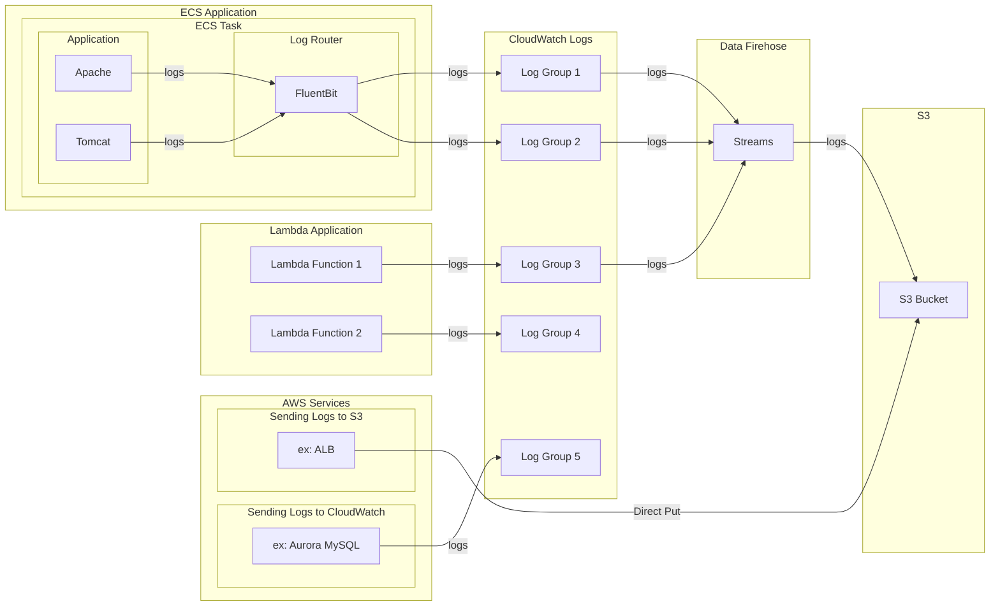
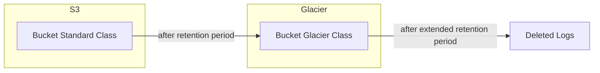

# ログ基本設計

**親ページ**

| 内容 | Markdownリンク | HTMLリンク |
|---|---|---|
| サイトマップ | [md](../sitemap.md) | <a href="../sitemap.html">html</a> |

**目次**
- [ログ基本設計](#ログ基本設計)
  - [全体像](#全体像)
    - [ライフサイクル](#ライフサイクル)
    - [運用](#運用)
      - [ログの確認](#ログの確認)
  - [FluentBit](#fluentbit)

## 全体像

### ライフサイクル

- 基本的な流れ
  1. アプリケーションやAWSサービスがCloudWatchにログを出力する
     - AWSサービスは直接S3に出力する場合もある
  2. CloudWatchからData Firehoseを経由してS3にログを転送する
  3. S3はライフサイクルに従い、一定期間経過したログをGlacierにアーカイブする
  4. Glacierは一定期間経過したログを削除する

### 運用

#### ログの確認
  1. CloudWatch Logs
     - 運用オペレーションにおいてはログの確認は基本的にCloudWatchから行う
     - GUIやLogs Insights等の高機能なログ管理機能が提供されている
     - コストが高いため長期間の保存には適さず、CloudWatch上のログは数ヶ月でローテーションする
  2. S3
     - 最終的にすべてのログはS3に格納される
     - CloudWatchでのローテーション後のログを確認できる
     - アプリケーションでログ集計するケースではCloudWatchではなくS3に保管されたログを参照する
     - Javaアプリケーションはログが構造化されていないためAthenaは利用できない

## FluentBit

[FluentBit](./fluentbit.md)
