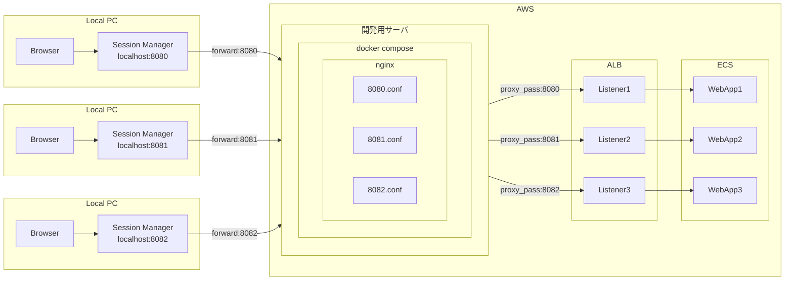

# nginx

## 構成

## 使い方

1. Session Managerでポートフォワーディングを実行
2. フォワードしたポートにブラウザ等からアクセス
3. nginxとALBを経由してターゲットにリクエストが届く

### 詳細

- ポート番号は各メンバーに割り当てます
- ポート番号ごとの設定を`XXXX.conf`で変更できます
  - デフォルトはnginx自身と同じポートのALBリスナーに転送

### nginx側の設定変更

1. vi等で`XXXX.conf`を編集
2. `docker container exec -it nginx nginx -s reload`を実行
   - 安全にファイル更新を適用する

## 管理者向け

### ディレクトリ構成

<pre>
├── setup
│   └── setup_docker_and_compose.sh
├── conf
│   └── nginx.conf
├── conf.d
│   ├── sites
│   │   ├── port_8080.conf
│   │   ├── port_8081.conf
│   │   └── port_8082.conf
│   │   └── port_XXXX.conf
│   └── variables.conf
├── docker-compose.yml
├── Dockerfile
└── README.md
</pre>

- setup
  - dockerおよびdocker composeをインストールするスクリプト
- conf/nginx.conf
  - proxy_passをホスト名で設定しているため、resolverを定義している
- conf.d/variables.conf
  - 全体に適用したい共通の環境変数を定義する
  - ALBのホスト名はここで定義する
- conf.d/sites/portXXXX.conf
  - nginxがListenするポートごとにファイルを作成する
  - 開発メンバーごとにポートを払い出す運用を想定
